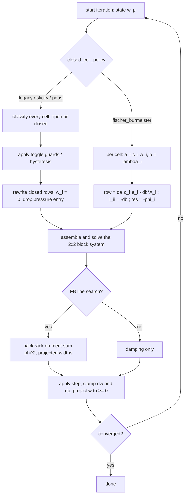

# Fracture opening (contact) formulations

How the open/closed state of a fracture cell is formulated in
`Fracture_fullSystemIteration.cpp`, what the four older formulations do, and how the
Fischer–Burmeister (FB) formulation added 2026-08-25 differs from them.

Selected by one key: `fractureparam.solver.closed_cell_policy` ∈
`legacy` · `sticky` (default) · `pdas` · `none` · `fischer_burmeister`.

---

## 1. The problem being solved

Each fracture cell *i* carries two unknowns: the aperture (width) `w_i` and the fluid
pressure `p_i`. Mechanically the cell sits between two crack faces that are pushed
together by the in-situ normal stress and pushed apart by the fluid:

```
            in-situ normal traction  σ_i   (compression positive)
            ↓    ↓    ↓    ↓    ↓    ↓    ↓
     ═══════════════════════════════════════════   upper crack face
            ↑ p_i  (fluid pressure)
        ← w_i →                       ↑ λ_i  (rock-on-rock contact traction,
     ─ ─ ─ ─ ─ ─ ─ ─ ─ ─ ─ ─ ─ ─ ─ ─ ─ ─      can only act when w_i = 0)
     ═══════════════════════════════════════════   lower crack face
            ↑    ↑    ↑    ↑    ↑    ↑    ↑
```

The elasticity is a dense boundary-element (DDM) relation: opening cell *j* changes the
normal traction on every cell *i*. With `A` the DDM matrix (negative-definite; see the
"since A is negative" note at the system assembly) the mechanical equation of an **open**
cell is

```
    (A w)_i + p_i = σ_i                         (mechanical equilibrium, cell open)
```

and the residual of that equation is exactly the missing traction:

```
    λ_i  :=  σ_i − (A w)_i − p_i                (code: tmp_i / lam)
```

`λ_i` is the **contact traction**: the extra compression the rock faces must carry so
that they do not interpenetrate. For a closed cell (`w_i = 0`, no elastic response)
`λ_i = σ_i − p_i` — the net confining stress, positive as long as the fluid cannot lift
the rock.

The physics is the classical Signorini (unilateral contact) condition:

```
    w_i ≥ 0        no interpenetration
    λ_i ≥ 0        contact can only push, never pull
    w_i · λ_i = 0  a cell is either open (λ = 0) or closed (w = 0), never both
```

which is an **L-shaped set** in the (w, λ) plane — the source of every difficulty below:

```
    λ  (contact traction)
    ↑
  * |                         admissible states = the two branches
  * |                         only.  Nothing in the interior,
  * |   CLOSED branch         nothing in the third quadrant.
  * |   w = 0, λ ≥ 0
  * |
  * |
  *●───────────────────────────────────────────→  w  (aperture)
    corner        OPEN branch:  λ = 0, w ≥ 0
   (w=0, λ=0)
```

The corner is where all the trouble lives: it is not differentiable, and during
fracture establishment dozens of cells sit right at it.

### The discrete system

The fracture solve is a Newton iteration on the 2×2 block system (`fullSystemIteration`,
[Fracture_fullSystemIteration.cpp:1045](Fracture_fullSystemIteration.cpp#L1045)):

```
     ┌         ┐ ┌    ┐   ┌            ┐
     │  A   I  │ │ dw │   │  mech res  │      A : dense DDM elasticity (n×n)
     │         │ │    │ = │            │      I : identity  (∂mech/∂p)
     │  C   M  │ │ dp │   │  flow res  │      M : fracture flow matrix
     └         ┘ └    ┘   └            ┘      C : ∂flow/∂w  (usually dropped, see below)
```

Contact enters **only through the first block row**. Every formulation below is a
different answer to one question: *what do we put in row i of `[A | I]` and in the
mechanical residual, given that cell i may be closed?*

---

## 2. The older formulations — a binary active set

All of `legacy`, `sticky` and `pdas` work the same way structurally: before each Newton
iteration they classify every cell as open or closed (`identify_closed`,
[Fracture_fullSystemIteration.cpp:823](Fracture_fullSystemIteration.cpp#L823)), then
**rewrite the rows of the closed cells**:

```
  row i, cell OPEN     [  A_i1  A_i2 ... A_in  |  0 ... 1 ... 0  ]   res_i = σ_i − (Aw)_i − p_i
                          ^ the real elasticity      ^ pressure

  row i, cell CLOSED   [   0     0   ... 1 ... |  0 ... 0 ... 0  ]   res_i = 0
                          ^ row replaced by identity → w_i = 0
                                                 ^ pressure entry zeroed
```

(`modified_fracture_matrix` + `makeIdentity(..., zero_rows = closed_cells)` +
`mech_rhs[i] = 0`.) So a closed cell is *pinned*: its width is frozen at zero and it no
longer feels pressure. The formulations differ only in the **rule** that fills
`closed_cells`:

| policy | rule (per cell, per Newton iteration) | character |
|---|---|---|
| `legacy` | close ⟺ `λ_i ≥ 0` **and** `w_i ≤ 0` | stateless, two separate tests |
| `sticky` (default) | open→closed ⟺ `λ_i ≥ close_force_tolerance` and `w_i ≤ 0`; closed→open ⟺ `λ_i ≤ −reopen_force_tolerance` | hysteresis; a closed cell stays closed until the force test says otherwise |
| `pdas` | close ⟺ `λ_i − c_i w_i > tol`, `c_i = |A_ii|` | one consistently scaled criterion (primal–dual active set = semismooth Newton on the **max** NCP function) |
| `none` | never close; negative width allowed (no clamp) | contact removed entirely — makes the block linear, physical only when contact is negligible |

`sticky` additionally carries guards on top of the rule: `max_closed_cell_toggle_count` /
`..._fraction` (reject an iteration that flips too many cells) and
`toggle_guard_mode=chatter` (per-cell flip counting). Both are damping devices for the
failure mode described next — they do not change the formulation.

### Why a binary set can cycle

The switch is a **discontinuous function of the iterate**. A cell one Pascal on the wrong
side of the threshold has its entire row replaced. During establishment this closes the
loop:

```
   ┌────────────────────────────────────────────────────────────────┐
   │  Newton iterate over-inflates the widths (the width update     │
   │  runs ahead of the pressure update)                            │
   │            ↓                                                   │
   │  over-inflated w ⇒ elastic back-stress ⇒ λ_i flips positive    │
   │  on ~half the cells (although the converged state is fully     │
   │  open at +80…100 bar net pressure!)                            │
   │            ↓                                                   │
   │  binary switch slams those cells shut (w := 0)                 │
   │            ↓                                                   │
   │  conductivity collapses, pressure redistributes, forces reverse│
   │            ↓                                                   │
   │  all of them reopen next iteration  ──────────────────────────┐│
   └───────────────────────────────────────────────────────────────┘│
                          the same cells, forever   ←────────────────┘
```

Measured on the 92-day caked model2 deck with `sticky`: **16 564 contact toggles**,
**151 nonlinear iterations per solve**, ~70 % of total runtime; on the adversarial
establishment reproducer the inner solve limit-cycles at the iteration cap (109–113 its)
and never converges. Neither damping nor the guards fix it: raising `max_iter`, `pdas`,
`toggle_guard_mode=chatter` and a 5×-smaller `max_dwidth` all still fail on that state
(`fixed_tests/NEXT_WORK.md`, item 1). The cycle lives in the *stationary* problem, so
timestep chopping does not help either.

---

## 3. The Fischer–Burmeister formulation

Instead of *deciding* which branch of the L each cell is on, replace the two branches by
a single smooth equation that is satisfied **exactly on the L and nowhere else**. The
Fischer–Burmeister function (A. Fischer, 1992) is

```
    φ(a, b)  =  a + b − √(a² + b²)
```

with the property

```
    φ(a, b) = 0   ⟺   a ≥ 0,  b ≥ 0,  a·b = 0
```

— i.e. the zero set of φ *is* the L-shaped set, exactly, with no regularisation
parameter and no approximation. Applied per cell with `a = c_i w_i` (aperture converted
to force units) and `b = λ_i` (contact traction), the mechanical row of cell *i* becomes

```
    φ_i(w, p)  =  c_i w_i  +  λ_i  −  √( (c_i w_i)² + λ_i² )  =  0
                                                              with c_i = |A_ii|
```

`c_i = |A_ii|` is the cell's own DDM self-stiffness: without it the two arguments would
be metres and Pascals and the function would be dominated by whichever unit happens to
be larger ([Fracture_fullSystemIteration.cpp:1204](Fracture_fullSystemIteration.cpp#L1204)).

### The Jacobian rows

φ is differentiable everywhere except at the corner (a = b = 0), where it is *semismooth*
— which is exactly what a semismooth Newton method needs. With
`r = √(a² + b²)`:

```
    ∂φ/∂a = 1 − a/r  =:  da            da + db → the blend weights
    ∂φ/∂b = 1 − b/r  =:  db
```

and, since `a = c_i w_i` and `b = σ_i − (A w)_i − p_i`,

```
    ∂φ_i/∂w_j  =  da·c_i·δ_ij  −  db·A_ij           →  A_FB row i
    ∂φ_i/∂p_i  =  −db                               →  I_FB diagonal
    residual   =  −φ_i                              (overwrites the linear mmv residual)
```

which is literally the code
([Fracture_fullSystemIteration.cpp:1184–1214](Fracture_fullSystemIteration.cpp#L1184),
residual override at
[:1345](Fracture_fullSystemIteration.cpp#L1345)):

```cpp
const double c_i = std::max(std::abs(Aorig[i][i]), eps);
const double a   = c_i * w[i][0];
const double b   = tmp_i;                       // λ_i
const double r   = std::sqrt(a*a + b*b) + eps;
const double da  = 1.0 - a / r;
const double db  = 1.0 - b / r;
fb_phi[i] = a + b - std::sqrt(a*a + b*b);
for (size_t j = 0; j < n; ++j) Afb[i][j] = -db * Aorig[i][j];
Afb[i][i] += da * c_i;
Ifb[i][i]  = -db;
```

### The row is a smooth blend of the two old rows

`da` and `db` are just the direction cosines of the state around the corner, and they
interpolate continuously between the two hard cases the old formulations switched
between:

```
  state of the cell        a = c·w   b = λ     da     db      resulting row i
  ──────────────────────────────────────────────────────────────────────────────────────
  wide open                 large     ≈ 0      ≈ 0    ≈ 1     −[A_i | 1] , res = −λ_i
                                                              ( = the open mech equation,
                                                                multiplied by −1 )

  firmly closed             ≈ 0       large    ≈ 1    ≈ 0     [ c_i on the diagonal | 0 ]
                                                              ( = the pinned row w_i = 0 )

  exactly at the corner     t         t        0.293  0.293   half of each — the row is a
  (a = b)                                                     genuine mixture, no jump
```

```
      db (weight on the elasticity row)          da (weight on the pin)
   1.0 ┤██████████████▓▓▓▓▒▒▒░░                ░░░▒▒▒▓▓▓▓██████████████ 1.0
       │        open ──────────────→ corner ←────────────── closed
   0.0 ┤        ░░░▒▒▒▓▓▓▓██████                ██████▓▓▓▓▒▒▒░░░        0.0
        a≫b                          a = b                        b≫a
```

That is the whole difference. The old formulations pick **one of the two rows**; FB uses
a weighted combination whose weights move continuously with the iterate. There is no
active set, so there is nothing that can flip — the limit cycle of §2 cannot form.
`identify_closed` returns an all-zero vector for this policy
([:848](Fracture_fullSystemIteration.cpp#L848)); the binary set survives only as a
metric.

### Globalization (both opt-in, both on in the shipped FB config)

The plain semismooth step overshoots far from the solution, so two additions
([:1706](Fracture_fullSystemIteration.cpp#L1706) and
[:1388](Fracture_fullSystemIteration.cpp#L1388)):

- **`fb_line_search`** — backtracking on the complementarity merit function
  `m(s) = Σ_i φ_i(w(s), p(s))²`, halving `s` from 1 down to `fb_line_search_min`
  (0.0625) until `m(s) ≤ (1 − 10⁻⁴ s) m(0)`, keeping the best `s` seen. Crucially the
  trial widths are **projected**, `w(s) = max(0, w + s·dw)`, so the merit is evaluated at
  the state the code will actually take (the same projection is applied to the accepted
  iterate at [:1772](Fracture_fullSystemIteration.cpp#L1772)).
- **`fb_scaled_convergence`** — test `|φ_i| / (1 + |a_i| + |b_i|)` instead of `|φ_i|`.
  φ mixes stiffness×width with force, and `c_i` varies with cell size and refinement
  level, so an unscaled tolerance means different physical accuracy on different cells.

The ordinary safeguards still apply on top: `damping`, `max_dwidth`, `max_dp`.

### One nonlinear iteration, side by side



---

## 4. Measured behaviour (92-day caked model2 deck, shipped flags)

From `data/best_practice/seq_implicit_fb.json` and `fixed_tests/NEXT_WORK.md`
(items 1, 1b, 2):

| | `sticky` (recommended) | `fischer_burmeister` (experimental) |
|---|---|---|
| contact toggles | 16 564 | **0** |
| nonlinear its / solve | 151 | **28** |
| wall clock | 201 s | 162 s plain; 87–237 s with the propagation gates |
| BHP day 10 / end (Reveal 469 / 412) | 456–465 / ≈420 | 462 / 416.5 |
| establishment | 520–530 m², on time | 491 m² (27×24), right shape |
| adversarial reproducer | aborts (limit cycle) | survives past the state — the only policy that does |

**The open blocker** is the onset. Plain tuned FB opens the fracture late and peaks at
601–639 bar where Reveal peaks at 495, recovering by day ~20 after ~52 chops. Prime
suspect is the interplay with the growth criterion — K1 is evaluated on FB's smaller
transient widths, so propagation starts later at a higher pressure. Note that the two
records disagree for the *gated* FB variant: NEXT_WORK item 1b reports 661 bar at day 3
as the remaining blocker, while the `seq_implicit_fb.json` header reports a 478 bar peak
(below Reveal's own 495) with no overshoot — different runs, not yet reconciled. Either
way FB is *not* the recommended default until the onset is understood; see NEXT_WORK
item 1.

---

## 5. Practical notes and gotchas

- **The mechanical block is no longer the plain DDM matrix.** Row *i* is scaled by `−db`
  and gets `+da·c_i` on the diagonal, so symmetry and the usual diagonal dominance
  arguments do not carry over. The FB config accordingly runs the coupled solve with
  `linsolver.scaling = blockmax` and `preconditioner.lu_pivoting = true`.
- **`closed_cells` is all-zero under FB.** Anything downstream that keys off the binary
  set — the coupling-matrix closed handling, the C-drop check, the toggle metric, the
  `--contact-report` in `replay_fracture_linear_system` — sees "nothing closed". Judge FB
  runs by width/area and BHP, not by contact counters.
- **Flow still floors the aperture** at `solver.min_width` for the cubic law; the contact
  formulation only decides the mechanical width, and the accepted iterate is still
  projected to `w ≥ 0` (unlike `closed_cell_policy=none`, which deliberately allows
  negative width and must not be clamped).
- **The FB row loop is O(n²) per cell row** because `λ_i` needs the dense `A_i·w`; same
  order as the old assembly, no new asymptotic cost.
- **Propagation gates are load-bearing with FB.** `conservative_propagation` +
  `propagate_open_front_only` (fresh rock opens only off a converged, open front) give
  FB's best result; without them FB ran away to 677 k m² on a marginal-front case. With
  `sticky` the same gates *starve* growth, because sticky's establishment solves rarely
  converge.

### Turning it on

```json
"solver": {
  "closed_cell_policy": "fischer_burmeister",
  "fb_line_search": true,
  "fb_scaled_convergence": true,
  "conservative_propagation": true,
  "propagate_open_front_only": true
}
```

Complete, runnable configuration: `data/best_practice/seq_implicit_fb.json`.
Option reference: `data/fracture_settings_REFERENCE.md`. Defaults are unchanged
(`sticky`), and the `REGTEST_geomech*` tests are bit-identical with FB available but off.

---

## 6. Where the alternatives stand

FB is not the only smooth answer, and the record is honest about it: semismooth
complementarity methods are mainstream in *computational contact mechanics*
(Signorini/obstacle problems, frictional contact — `pdas` is the max-function sibling of
the same family), but the NCP-flash literature in porous media (Lauser et al., AWR 2011)
has not been widely adopted by production reservoir simulators. Alternatives kept on the
table in NEXT_WORK item 1: regularized/penalty contact (a stiff spring below zero width,
smooth by construction, at the cost of a regularization parameter), reduced-space
active-set Newton with a line search on the variational inequality, Anderson acceleration
on the outer switching fixed point, and reducing the exposure altogether by
equilibrium-targeted expansion (fewer far-from-equilibrium states to overshoot on).
